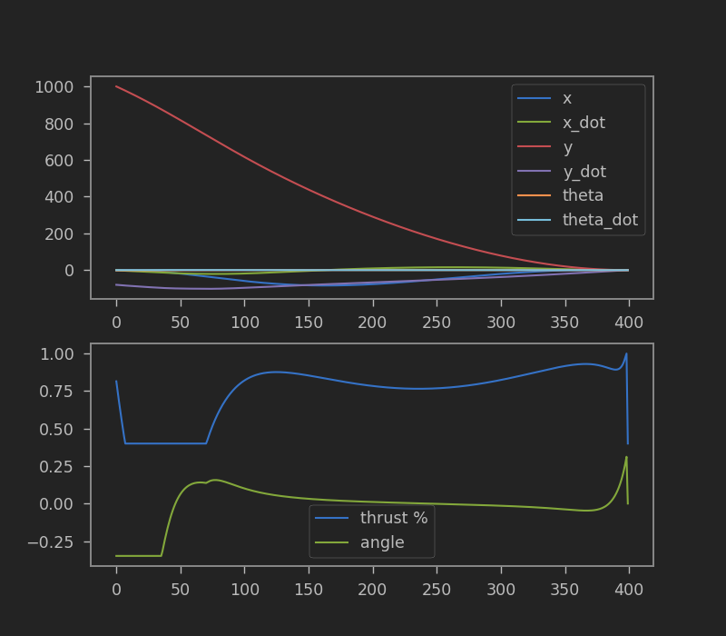
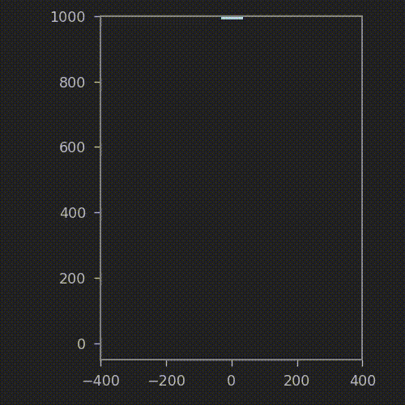

# Starship Landing Trajectory Optimization
Trajectory Optimisation for Starship Landing

## Landing a rocket! — The code
Now onto the fun stuff. There are some amazing libraries out there that churn through equations and do the heavy lifting of optimization, so the real “art” lies in asking the right question to the solver.

Corrisponding code for: https://thomas-godden.medium.com/how-spacex-lands-starship-sort-of-ee96cdde650b

## Setup

### Conda Environment Setup

To install Anaconda follow the instructions in this [webpage](https://www.digitalocean.com/community/tutorials/how-to-install-the-anaconda-python-distribution-on-ubuntu-20-04-quickstart)

Create a conda environment for the PyBullet tutorial:  
```
$ conda create --name traj_opt  
```
Switch to the newly create environment (you will notice the name of the environment on the command line in the extreme left):  
```
$ conda activate traj_opt  
```

Then, clone the repository on your system:
```
git clone https://github.com/RoML-IISc/StarshipTrajOpt.git
```
Install the following required packages:
```
pip install -r requirements.txt
```
```
conda install -c conda-forge ffmpeg
```


## Running the code

```
python3 starship.py
```
## Graphs


## Videos



## Credits: 

[How SpaceX lands Starship (sort of)](https://thomas-godden.medium.com/how-spacex-lands-starship-sort-of-ee96cdde650b)
